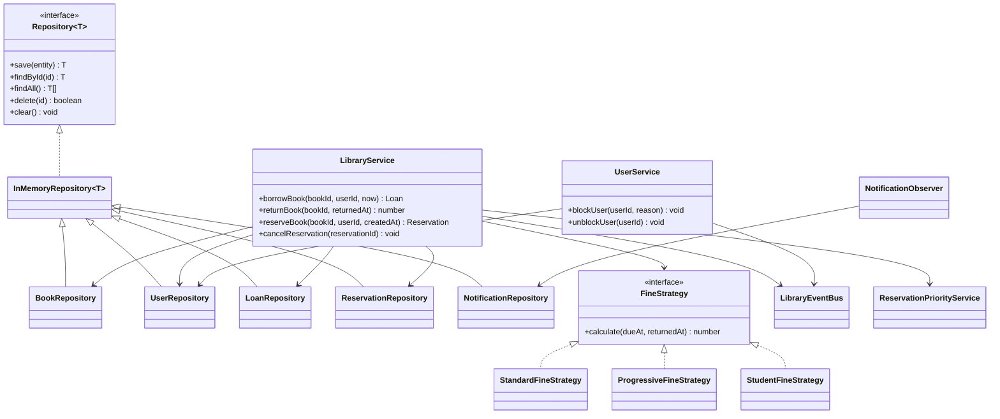

# Class Diagram

```mermaid
classDiagram
  class Repository~T~ {
    <<interface>>
    +save(entity) T
    +findById(id) T
    +findAll() T[]
    +delete(id) boolean
    +clear() void
  }
  class InMemoryRepository~T~
  class BookRepository
  class UserRepository
  class LoanRepository
  class ReservationRepository
  class NotificationRepository
  Repository <|.. InMemoryRepository
  InMemoryRepository <|-- BookRepository
  InMemoryRepository <|-- UserRepository
  InMemoryRepository <|-- LoanRepository
  InMemoryRepository <|-- ReservationRepository
  InMemoryRepository <|-- NotificationRepository

  class FineStrategy {
    <<interface>>
    +calculate(dueAt, returnedAt) number
  }
  class StandardFineStrategy
  class ProgressiveFineStrategy
  class StudentFineStrategy
  FineStrategy <|.. StandardFineStrategy
  FineStrategy <|.. ProgressiveFineStrategy
  FineStrategy <|.. StudentFineStrategy

  class LibraryService {
    +borrowBook(bookId, userId, now) Loan
    +returnBook(bookId, returnedAt) number
    +reserveBook(bookId, userId, createdAt) Reservation
    +cancelReservation(reservationId) void
  }
  class UserService {
    +blockUser(userId, reason) void
    +unblockUser(userId) void
  }
  class LibraryEventBus
  class NotificationObserver
  class ReservationPriorityService

  LibraryService --> BookRepository
  LibraryService --> UserRepository
  LibraryService --> LoanRepository
  LibraryService --> ReservationRepository
  LibraryService --> FineStrategy
  LibraryService --> LibraryEventBus
  LibraryService --> ReservationPriorityService
  UserService --> UserRepository
  UserService --> LibraryEventBus
  NotificationObserver --> NotificationRepository
```
