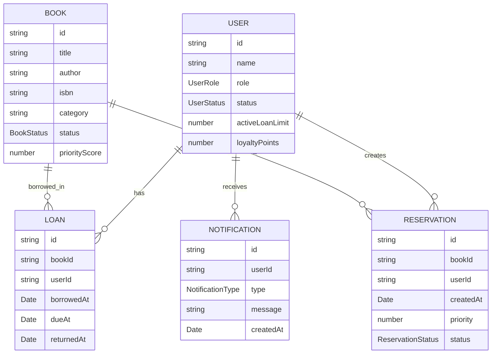

# Domain Model

```mermaid
erDiagram
  USER ||--o{ LOAN : has
  USER ||--o{ RESERVATION : creates
  USER ||--o{ NOTIFICATION : receives
  BOOK ||--o{ LOAN : borrowed_in
  BOOK ||--o{ RESERVATION : reserved_in

  USER {
    string id
    string name
    UserRole role
    UserStatus status
    number activeLoanLimit
    number loyaltyPoints
  }
  BOOK {
    string id
    string title
    string author
    string isbn
    string category
    BookStatus status
    number priorityScore
  }
  LOAN {
    string id
    string bookId
    string userId
    Date borrowedAt
    Date dueAt
    Date returnedAt
  }
  RESERVATION {
    string id
    string bookId
    string userId
    Date createdAt
    number priority
    ReservationStatus status
  }
  NOTIFICATION {
    string id
    string userId
    NotificationType type
    string message
    Date createdAt
  }
```
