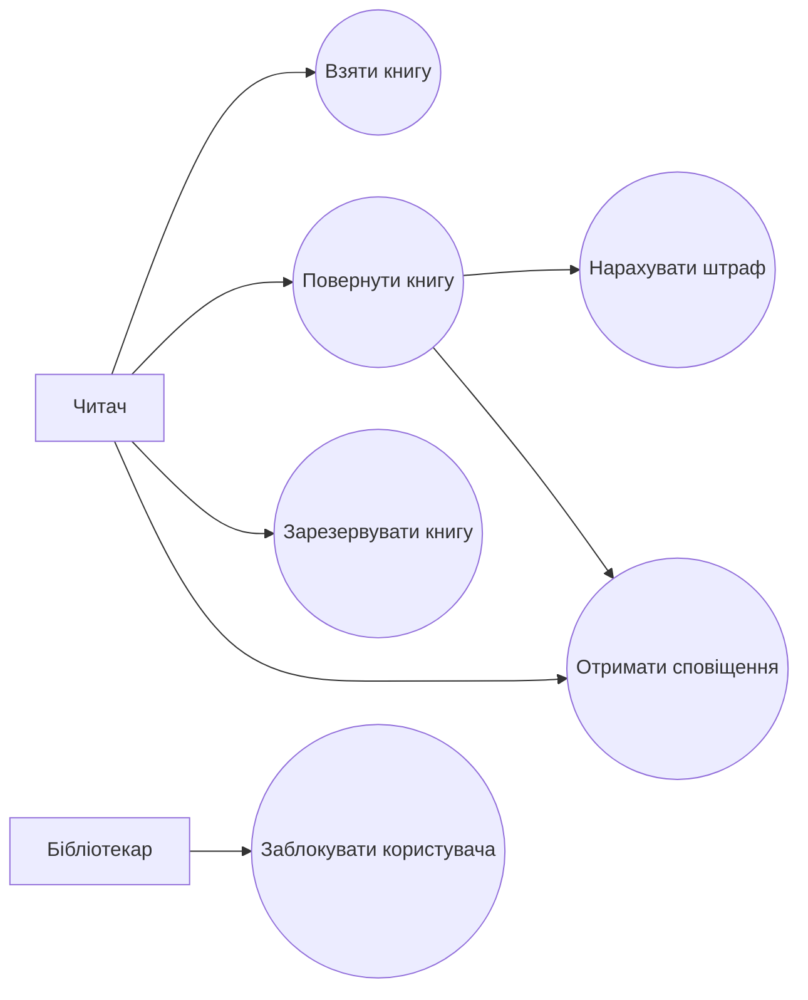

# Use Case Diagram

```mermaid
flowchart LR
  Reader[Читач]
  Librarian[Бібліотекар]
  Borrow((Взяти книгу))
  Return((Повернути книгу))
  Reserve((Зарезервувати книгу))
  Fine((Нарахувати штраф))
  Notify((Отримати сповіщення))
  Block((Заблокувати користувача))

  Reader --> Borrow
  Reader --> Return
  Reader --> Reserve
  Reader --> Notify
  Librarian --> Block
  Return --> Fine
  Return --> Notify
```
